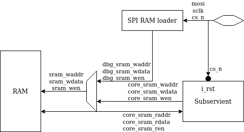

# SPI RAM loader example for Subservient

## Instructions

    # Install FuseSoC
    pip install --user fusesoc

    # Create and enter a workspace
    mkdir workspace && cd workspace

    # Add required FuseSoC libraries
    fusesoc library add fusesoc-cores https://github.com/fusesoc/fusesoc-cores
    fusesoc library add serv https://github.com/olofk/serv
    fusesoc library add subservient https://github.com/olofk/subservient
    fusesoc library add spi_ram_loader https://github.com/olofk/spi_ram_loader

    # Run SoC cocotb simulation
    MODULE=test_soc fusesoc run --target=socsim spi_ram_loader

## Example

subservient_with_spi_ram_loader_and_ram contains a basic example on how to use spi_ram_loader together with a SoC to preload an application into a memory before running it. When cs_n is pulled low, the system enters debug mode where the SoC is held in reset. Each byte written over SPI will be written sequentially to the SRAM. When cs_n is released, the system will leave reset and start executing the code from memory.

